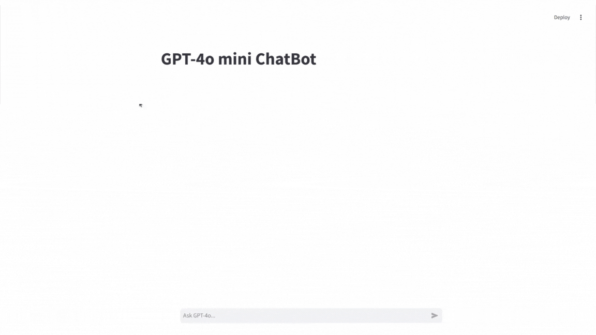

# GPT-4o-mini-ChatBot

## About the website
This website was developed as a learning project to explore the integration of Python, OpenAI, and Streamlit. The primary goal was to create a real-time chatbot application that leverages the OpenAI API for natural language processing and Streamlit for the server-side implementation. The application enables seamless, real-time communication between the user and the chatbot.

## How to use and what you need
* The **requirements.txt** file specifies the primary libraries used in the project:
   * **OpenAI**: This library is responsible for interacting with the OpenAI API to generate text-based responses to user prompts.
   * **Streamlit**: Streamlit is used to create the web application's user interface and manage the application's server.

* To run the application, please follow these steps:
   * **Follow the tutorial**: Refer to the `tutorial.txt` file for detailed instructions.
   * **Create a configuration file**: Create a `config.json` file and add your OpenAI API key, which can be obtained from the OpenAI website.

## Basic usage
1. Create a Python virtual environment: Set up an isolated Python environment for the project.
2. Activate the virtual environment: Activate the newly created virtual environment.
3. Install dependencies: Install the required libraries listed in `requirements.txt`.
4. Start the server: Run the command **`streamlit run src/main.py`** to start the Streamlit application. A successful startup will display a message indicating that the app is now accessible in your browser, along with the local and network URLs.
5. Stop the server: Press **`Ctrl+C`** to terminate the server.

## Introduction to the website
This website was created as a learning project to explore the capabilities of Streamlit in building web applications and OpenAI in developing chatbots. The primary function of this website is to provide a user-friendly interface where users can input text-based queries and receive relevant responses generated by a chatbot.

## Website details
The homepage features a simple input field where users can type their questions. Upon submission, the chatbot processes the query and provides a response. This interactive experience is designed to mimic real-time conversations.

### Postscript
This project serves as a practical application of Streamlit and OpenAI, specifically utilizing the GPT-4o mini model. The intent is solely for educational and experimental purposes. There are no commercial intentions associated with this project. Thank you for visiting my chatbot application project. Your feedback is highly appreciated.
